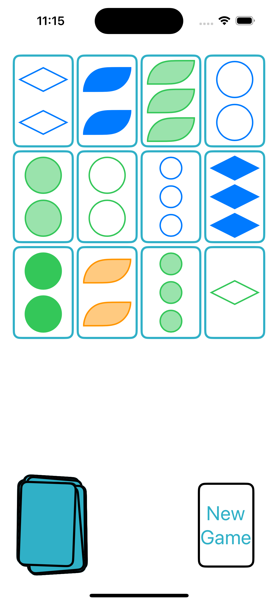
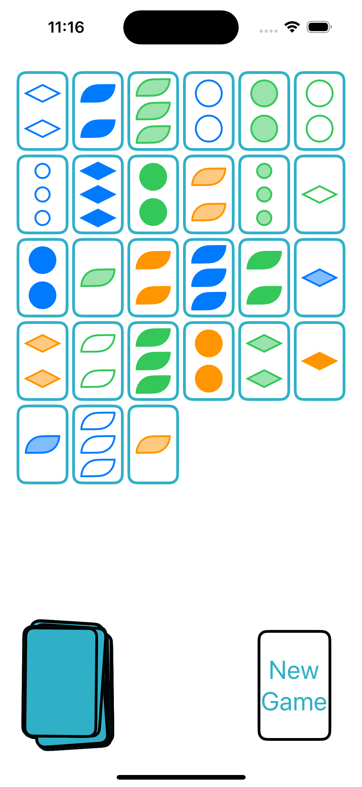

# Set Card Game - Mobile Implementation

A single-player interactive mobile version of the classic **Set** card game, built as a learning project.

## 🎮 Gameplay
The goal of the **Set** game is to find sets of three cards that follow specific rules regarding shape, color, number, and shading.

## 📌 Features
- Interactive UI for selecting sets.
- Single-player mode.
- Modern mobile-friendly design.

## 🛠 Technologies Used
- **SwiftUI** for UI development.
- **Swift** for game logic.
- **MVVM** architecture for clean code structure.

## 📱 Screenshots

